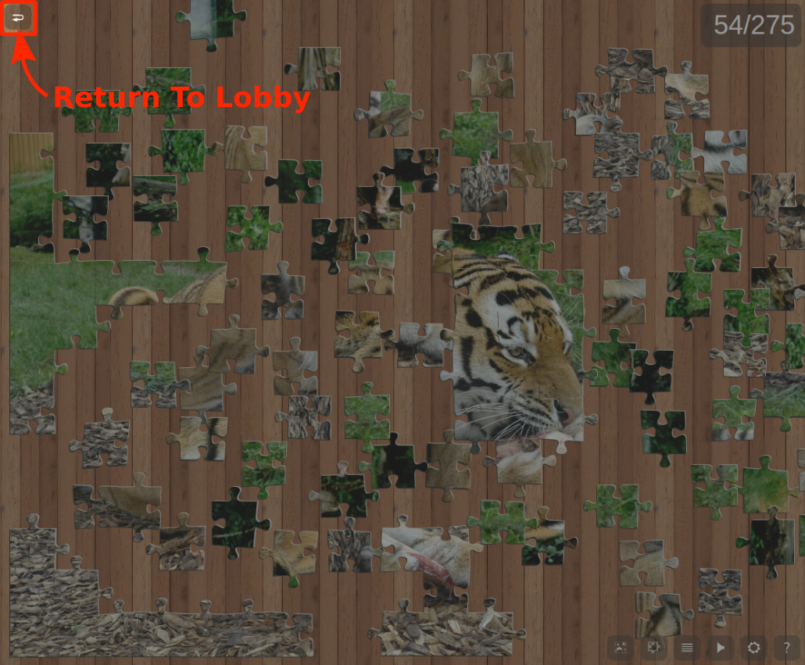

<p align="center">
   
</p>

# yaps - „Yet Another Puzzle Sim"
„Yet Another Puzzle Sim" is a simple Node.js-based engine to host and play jigsaw puzzles in a browser.
This project features a lobby system and different options to play together or individually.
Once the server is running and accessible (possibly check settings for port forwarding) anyone can join and create new sessions.
Most components of this project have been finished, some more will be implemented soon.

## Contents

* [Description and Screenshots](#description-and-screenshots)
* [Server Setup](#server-setup)
* [Optional Server Configuration](#optional-server-configuration)

## Description and Screenshots
* Profile Setup: Enter your name at the top. This name will be shown to other players.
<p align="center"></p>

* Profile Setup: Select a color at the bottom. This color identifier will be displayed alongside your name.
<p align="center"></p>

* These are the currently listed sessions. You can join a session by double-clicking
<p align="center"></p>

* The lock-icon idicates the requirement for a passphrase to enter the session.
<p align="center"></p>

* The tile-icon represents the tile shape difficulty, i.e. how recognizable the edges of the pieces are. The difficulty is ranked from copper over silver and gold to diamond.
<p align="center"></p>

* Here an icon is shown if the puzzle pieces can and have to be rotated to solve the puzzle. Otherwise, all tiles are already in their correct orientation.
<p align="center"></p>

* Those icons are followed by the name of the session.
<p align="center"></p>

* This column shows the current progress of the game. The first number corresponds to the number of already established connections whereas the second is the total number of connections needed for a completed puzzle.
<p align="center"></p>

* The last column shows the current and maximum number of players in a session.
<p align="center"></p>

* These buttons allow you to refresh the currently listed sessions or begin setting up your own.
<p align="center"></p>

* When creating your own session, there are several settings you can choose from. In the highlighted box you can enter the session's name.
<p align="center"></p>

* If you like, you can enable the passphrase-requirement and enter the respective passphrase in the corresponding box.
<p align="center"></p>

* This setting determines the number of pieces into which your motif will be cut. Note that the value is given in relation to the motif's longer edge, i.e. horizontally for an image in landscape format or vertically for one in a portrait format, respectively.
<p align="center"></p>

* Here you can select the maximum number of players you want to allow into your session.
<p align="center"></p>

* Here you can select the difficulty. Copper through gold correspond to the well-known characteristic shape of jigsaw puzzle pieces but with decreasingly distinctive features, whereas the diamond setting yields flat edges for all pieces.
<p align="center"></p>

* Here you can select whether rotation of tiles is required and whether or not to keep track of connections made per player (which will be visible to all players in a session).
<p align="center"></p>

* Use the file selection dialog or simply drag an image from your disk onto the respective button to select an image as puzzle motif. After the file has been selected, you will see a small preview.
<p align="center"></p>

* Finally, these buttons can either start the currently configured session or get you back to the list of already running sessions.
<p align="center"></p>

* The in-game controls used in yaps mostly rely on mouse. You can use the shift-key to adjust the zoom more precisely.
<p align="center"></p>

* In the bottom right there is a list of buttons which give you quick access to several additional features. For example, the toggle button for shadows of puzzle pieces can be used to find pieces that are hidden behind others.
<p align="center"></p>

* The top right contains a progress counter which displays the currently made connections between pieces and the number required for completion of the puzzle.
<p align="center"></p>

* The button at the top left lets you return to the lobby screen.
<p align="center"></p>

* In the list of players you can also see additional information: The host is marked by a crown symbol. If you are in a competitive session you can also see the score by player. Lastly, the current host can (permanently) kick players from this session.
<p align="center"></p>

## Server Setup
The host of the game, i.e. the person running the server, has to install Node.js (server software) and a few small packages. Here is a detailed description of what the host has to do to set up yaps:

1. Install `Node.js` including `npm` from [here](https://nodejs.org/).

   (Optional: I recommend to add the binary directory of Node.js to your path variable<sup>a</sup>.)
2. Download the contents of this repository and move them into a clean directory.
3. Open a shell in the newly created yaps directory<sup>b</sup>. Execute `npm` to install the components `express` and `socket.io` using the command
   ```console
   $ <path-to-npm>/npm install express socket.io
   ```
4. Test the server by issuing
   ```console
   $ <path-to-node>/node index.js
   ```
   in the shell. If no errors occured, a message appears showing on which port the server is listening. Furthermore, your public IP-address/the server's url is shown in the format XXX.XXX.XXX.XXX:8080 . Paste this address (or simply localhost:8080 if you are on the same machine) into your browser address bar and connect to the server. You can easily change the local port by editing the line `const port = 8080;` in the file `index.js`.
5. In order to give other people access to your server, you possibly have to configure your router to forward/map the port accordingly (TCP). Other players can then join your game using the IP-address from above.

<sup>a</sup> The Windows-installer offers to do so automatically. Alternatively, see the instructions for Windows [here](https://stackoverflow.com/a/9546345).

<sup>b</sup> On Windows use Shift+Right Click in the directory then select the shell option from the context menu (see explanation for Windows [here](https://stackoverflow.com/a/60914)).

## Optional Server Configuration
Here is a list of the more interesting properties that can still be adjusted easily:

* **Max. Number of Sessions**: The maximum number of active sessions can be set in `const max_number_of_sessions = 10;`.
* **Max. Number of Players**: The maximum number of players per session can be set in `const nMaximumPlayers = 20;`.
* **Idle Timeout**: If a session has no activity for some time, it will be shut down. There are three timers associated with this process: With `const puzzleIdleCheck = 10;` the frequency of activity checks is configured, `const puzzleIdle = 300;` denotes the duration after which, if the session remains inactive, a countdown for a timeout is started. The latter is given in the line `const idlePuzzleTimeout = 300;`. All values are given in seconds.
* **Completion Timeout**: The completion timeout countdown of a session starts immediately on completion of the puzzle. Its duration in seconds can be set in the line `const completionPuzzleTimeout = 300;`.
* **Limitation for Number of Pieces**: The number pieces a puzzle can have is limited both towards lower and upper values. This is controlled in the line `const nMaximumPiecesPerDirection = 30, nMinimumPiecesLongDirection = 5, nMinimumPiecesShortDirection = 3;`. In order to let clients use an increased range of values, also the two lines `const nMinimumPiecesLongDirection = 5;` and `const nMaximumPiecesPerDirection = 30;` in `lib/game.js` have to be edited accordingly. Note that values above the upper margin `nMaximumPiecesPerDirection` can lead to a significant drop in performance on the client side due to the large number of elements with possibly complex cut paths.
* **Port**: The local port of the server can be set by modifying the line `const port = 8080;`.
* **Temporary Directory**: The local local directory in which the currently used puzzle motifs are stored can be set by modifying the line `const tmpdir = "tmp";`.

Simply modify the file `index.js` to your liking.